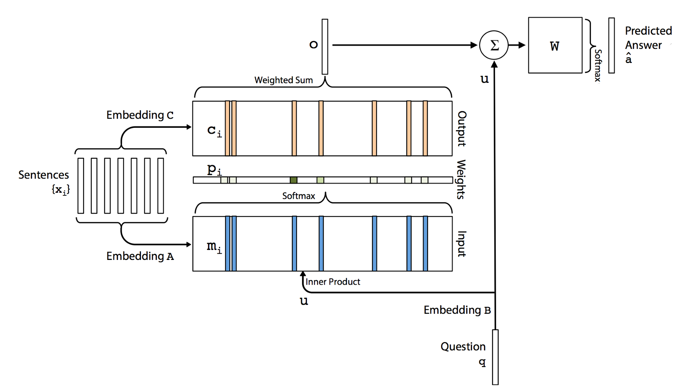
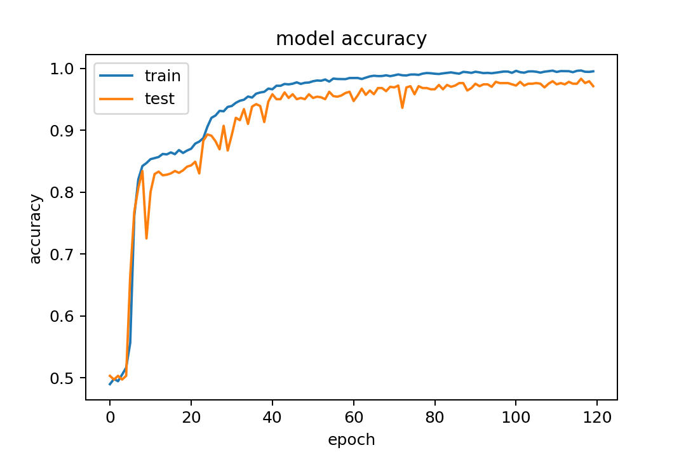

# Question-Answering-with-End-to-End-Memory-Network
Use end-to-end memory networks architecture for Question &amp; Answering NLP system

# Project objective

# Dataset

The project uses the bAbI dataset from Facebook Research. The dataset is available [here](https://research.fb.com/downloads/babi/). bAbI dataset is composed of several sets to support 20 tasks for testing text understanding and reasoning as part of the bAbI project. The aim is that each task tests a unique aspect of text and reasoning, and hence test different capabilities of learning models. The datasets are in english.
- For each task, there are 1000 questions for training, and 1000 for testing. So our project uses a set with 1000 questions for training and 1000 questions for testing.
- A sample item in the set is composed of a story (several short sentences), a question and the answer to the question for training purpose.
- Each task tests a unique aspect of learning capabilities: Dialog in the restaurant domain, children's book missing word test, Movie dialog, questions-detailed answers dataset, path or localization problems....

In our case, the answers are simply Yes / No answers. Example of the dataset is show below.

# Memory Networks Architecture

This architecture was published in 2015 and you can refer to the original [paper](https://arxiv.org/abs/1503.08895) for its detailed description.

# Results

Story:
- Daniel grabbed the apple there.
- Daniel went to the bedroom.
- John moved to the garden.
- Sandra journeyed to the office.
- Daniel put down the apple.
- Mary went to the bedroom.
- Mary grabbed the apple there.
- Sandra went back to the garden.
- Mary went to the kitchen.
- Daniel went to the office.

  - Question: Is Mary in the garden?  ==> Answer: no
  - Question: Is Mary in the kitchen?  ==> Answer: yes
  - Question: Is Mary in the bedroom?  ==> Answer: no
